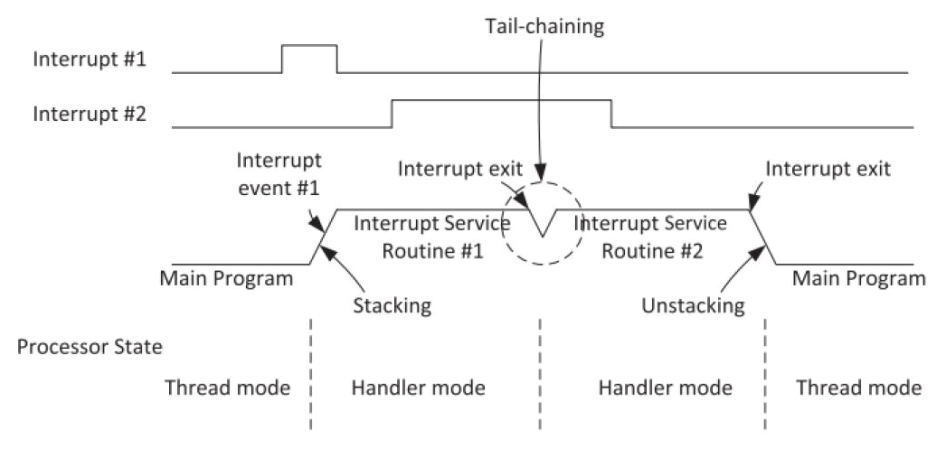
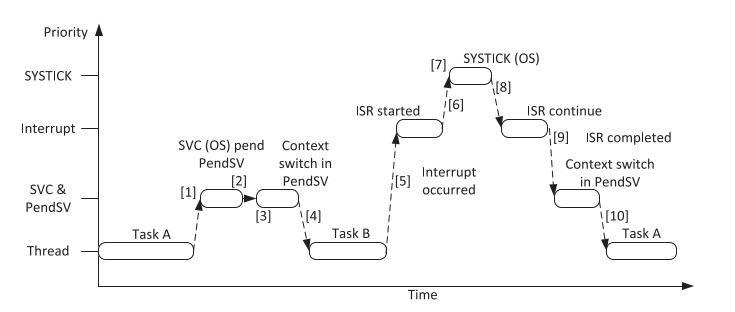
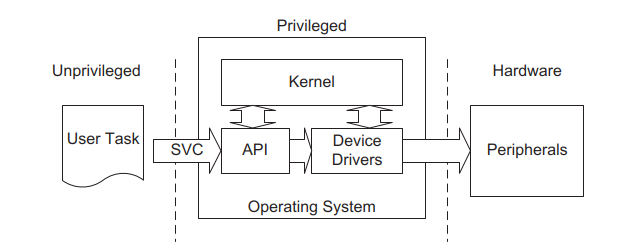
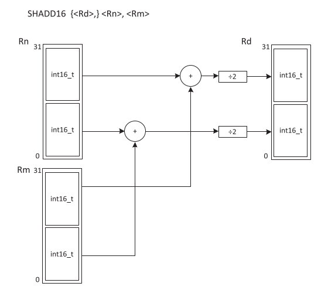

# Arquitectura de Microprocesadores 

# Carrera de Especialización en Sistemas Embebidos - Universidad de Buenos Aires 

## Preguntas orientadoras 


#### 1. Describa brevemente los diferentes perfiles de familias de microprocesadores/microcontroladores de ARM. Explique alguna de sus diferencias características.


Los perfiles se definen de la siguiente manera:

`ARMv7-A`

`Application:` Son procesadores de **alto rendimiento** y están orientados a sistemas operativos embebidos de alta performance y **alto nivel de paralelismo**.

- Varios núcleos (alta frecuencia)
- “Mucha” memoria RAM
- Memoria caché…

`ARMv7-R`

`Realtime:` Son procesadores orientados a sistemas de tiempo real donde es necesario implementar soluciones de **baja latencia**, **alta predictibilidad** y **alta capacidad de cómputo**. Suelen utilizarse en **sistemas críticos**. Ejemplo: sistemas del automóvil
(control de tracción, frenos, etc.); dispositivos críticos: médicos, industriales, etc

`ARMv7-M`

`Microcontroller:` Son procesadores orientados a dispositivos de **consumo masivo** y sistemas **embebidos compactos**. Están diseñados para alta densidad de código y ser programados en C.


## Cortex M

#### 1. Describa brevemente las diferencias entre las familias de procesadores Cortex M0, M3 y M4.

- `Cortex M0/M0+:` Pensados para una implementación mínima, de bajo consumo y bajo costo.

- `Cortex M3/M4/M7:` Agregan mayor performance, más funcionalidades (división por hardware), FPU, MPU, etc.

#### 2. ¿Por qué se dice que el set de instrucciones Thumb permite mayor densidad de código? Explique.

ARM incorporó un novedoso mecanismo llamado arquitectura “Thumb”. 
El set de instrucciones Thumb es una forma comprimida a 16 bits del set de instrucciones ARM de 32 bits original y emplea hardware dedescompresión dinámica en la instrucción pipeline, para descomprimir las instrucciones de 16 a 32 bits.
Por supuesto, la etapa extra requerida para manejar instrucciones de 16 bits afecta el rendimiento.
La densidad del código Thumb es mejor que la alcanzada por la mayoría de los procesadores CISCs.

 
#### 3.	¿Qué entiende por arquitectura load-store? ¿Qué tipo de instrucciones no posee este tipo de arquitectura? 

Como la mayoría de los procesadores RISCs, el ARM emplea una arquitectura carga-almacenamiento. Esto significa que el set de instrucciones solamente procesará (adición, substracción, etc.) valores que estén en los registros o directamente especificados dentro de la instrucción en sí misma y siempre se obtendrá el resultado de tales procesos en un registro. 

Las únicas operaciones que se aplican a la memoria son aquellas que copian datos de la memoria en los registros (instrucciones de carga) o copian datos de los registros en la memoria (instrucciones de almacenamiento).

**ARM no soporta operaciones memoria a memoria.** Por lo tanto todas las instrucciones ARM caen en una de las tres categorías siguientes:
- 1. Instrucciones que procesan datos. Solamente usan y modifican valores en registros. Una instrucción, por ejemplo, puede sumardos registros y ubicar el resultado en otro registro.
- 2. Instrucciones de transferencia de datos. Estas copian los datos de la memoria en registros (instrucciones de carga) o copian los datos de los registros en la memoria (instrucciones de almacenamiento). Una forma adicional, útil solamente en códigos de sistemas, intercambian un dato en memoria con un dato en un registro.
- 3. Instrucciones de control de flujo. Normalmente se ejecutan instrucciones ubicadas en direcciones de memorias consecutivas. Aunque frecuentemente el control del flujo de las instrucciones ocasiona que la ejecución conmute en una dirección diferente, ya sea en forma permanente (instrucciones de salto) o guarde una dirección de retorno para recuperar la secuencia original (instrucciones de salto y retorno) o ejecute un código de llamadas al supervisor del sistema, instrucciones tipo trapping, “atrapadas”.

En la arquitectura de carga-almacenamiento utilizada en ARM, las instrucciones se dividen en dos categorías: acceso a la memoria (carga y almacenamiento entre la memoria y los registros) y operaciones ALU (que solo ocurren entre los registros). A diferencia de una arquitectura de registro-memoria, como x86, donde uno de los operandos para una operación ADD puede estar en la memoria mientras que el otro está en un registro. Por lo tanto, las instrucciones que no se admiten en este tipo de arquitectura son aquellas que realizan operaciones directamente en posiciones de memoria.

En cuanto a la arquitectura ARM en general, se basa en una arquitectura RISC y utiliza el enfoque de carga-almacenamiento. Las instrucciones se dividen en dos categorías: acceso a la memoria (carga y almacenamiento entre la memoria y los registros) y operaciones ALU (que solo ocurren entre los registros)3. Esto significa que las operaciones se realizan principalmente entre registros y no directamente en posiciones de memoria.


#### 4.	¿Cómo es el mapa de memoria de la familia? 

El mapa de memoria de la familia ARM varía dependiendo del modelo específico y la implementación de la arquitectura. Sin embargo, en términos generales, la familia ARM utiliza una estructura de memoria en la que se divide el espacio de direcciones
en diferentes regiones.
A modo de descripción general del mapa de memoria típico de la familia ARM, podemos considerar la siguiente subdivisión de regiones:

* Zona de código (Code Section): Esta zona se utiliza para almacenar el código ejecutable, como las instrucciones del programa y las constantes. Es una región de solo lectura (read-only) y suele estar ubicada en la parte inferior del espacio de direcciones.
* Zona de datos (Data Section): Esta zona se utiliza para almacenar los datos del programa, como variables globales y estáticas. Puede ser de lectura y escritura (read-write) y suele estar ubicada en la parte superior del espacio de direcciones.
* Pila (Stack): La pila se utiliza para almacenar las variables locales y los registros de activación de las funciones. Generalmente crece hacia abajo en la memoria y se encuentra en la parte superior del espacio de direcciones.
* Montón (Heap): El montón se utiliza para almacenar datos dinámicos, como objetos o estructuras de datos creados en tiempo de ejecución. Generalmente crece hacia arriba en la memoria y se encuentra en la parte inferior del espacio de direcciones.
* Además de estas regiones principales, también puede haber otras regiones en el mapa de memoria, como zonas reservadas para el sistema operativo, controladores de dispositivos, tablas de vectores de interrupción, entre otros.
      
|------------------------------------|
|        Zona de código (ROM)        |
|------------------------------------|
|        Zona de código (RAM)        |
|------------------------------------|
|        Zona de datos (RAM)         |
|------------------------------------|
|               Pila                 |
|------------------------------------|
|               Montón               |
|------------------------------------|
|        Zona de dispositivos        |
|------------------------------------|     
|          Zona de sistema           |
|------------------------------------|

#### 5.	¿Qué ventajas presenta el uso de los “shadowed pointers” del PSP y el MSP? 

El uso de "shadowed pointers" (punteros en sombra) en el PSP (Process Stack Pointer) y el MSP (Main Stack Pointer) en la arquitectura ARM presenta varias ventajas:
* Seguridad: Los "shadowed pointers" permiten tener una copia de seguridad de los punteros de pila principales (PSP y MSP). 
Esto es útil en caso de que se produzca un desbordamiento de pila o un error en el programa, ya que se puede acceder a la copia en sombra para recuperar la integridad del sistema.
* Protección contra overflow (desbordamiento) de pila: El uso de "shadowed pointers" puede ayudar a detectar y proteger contra desbordamientos de pila. Si se produce un overflow en el PSP o el MSP, la copia en sombra se mantendrá intacta y se podrá utilizar para detectar el overflow y tomar medidas correctivas.
* Facilidad de depuración: Al tener una copia en sombra de los punteros de pila, se facilita la depuración de errores relacionados con la pila. Se pueden utilizar herramientas de depuración para comparar los valores de los punteros en sombra con los valores actuales y detectar cualquier discrepancia o anomalía.
* Recuperación de errores: En caso de que se produzca un error crítico en el programa y se pierda la integridad de los punteros de pila principales, los "shadowed pointers" pueden utilizarse para recuperar el sistema y restaurar los valores correctos de los punteros de pila.
En resumen, el uso de "shadowed pointers" en el PSP y el MSP proporciona una capa adicional de seguridad y protección contra desbordamientos de pila, facilita la depuración de errores relacionados con la pila y permite la recuperación del sistema en caso de errores críticos.

#### 6.	Describa los diferentes modos de privilegio y operación del Cortex M, sus relaciones y como se conmuta de uno al otro. Describa un ejemplo en el que se pasa del modo privilegiado a no priviligiado y nuevamente a privilegiado. 

El procesador Cortex-M de ARM utiliza un modelo de seguridad basado en modos de privilegio y operación para garantizar la protección y el aislamiento entre diferentes niveles de software. Los modos de privilegio y operación en el Cortex-M son los siguientes:
* Modo Handler (Privilegiado): Este modo es el más alto en términos de privilegios y se utiliza para ejecutar rutinas de manejo de excepciones y eventos, como interrupciones y excepciones de sistema. En este modo, se tiene acceso completo a todas las instrucciones y registros del procesador.
* Modo Thread (Privilegiado): Este modo se utiliza para la ejecución de tareas normales del programa. En este modo, se tiene acceso completo a todas las instrucciones y registros del procesador.
* Modo Unprivileged (No privilegiado): Este modo es el de menor privilegio y se utiliza para ejecutar tareas con restricciones de seguridad. En este modo, se restringe el acceso a ciertas instrucciones y registros del procesador, lo que ayuda a proteger el sistema operativo y las aplicaciones de software de posibles amenazas.
La conmutación entre los diferentes modos de privilegio y operación se realiza mediante el cambio de bits específicos en el registro de estado (PSR) del procesador. El bit de Control (CONTROL) en el PSR se utiliza para habilitar o deshabilitar el cambio de modo privilegiado a no privilegiado y viceversa.
A continuación, se describe un ejemplo de cómo se pasa del modo privilegiado al no privilegiado y nuevamente al modo privilegiado:
* Inicialmente, el procesador se encuentra en el modo privilegiado (Modo Handler o Modo Thread).
* Se ejecuta una instrucción que cambia el bit de Control en el PSR para habilitar el modo no privilegiado.
* A partir de ese momento, el procesador se encuentra en el modo no privilegiado, donde se restringe el acceso a ciertas instrucciones y registros.
* Durante la ejecución en el modo no privilegiado, se produce una excepción o interrupción.
* El procesador cambia automáticamente al modo privilegiado (Modo Handler) para manejar la excepción o interrupción.
* Una vez finalizada la rutina de manejo de excepciones, se ejecuta una instrucción que cambia nuevamente el bit de Control en el PSR para habilitar el modo privilegiado.
* A partir de ese momento, el procesador se encuentra nuevamente en el modo privilegiado (Modo Handler o Modo Thread).
No se puede regresar directamente del modo no privilegiado al modo privilegiado. Si se desea hacerlo, se debe disparar una interrupción o excepción que saque al sistema del modo no privilegiado y lo lleve al modo Handler (privilegiado); sólo estando en un modo privilegiado se puede cambiar el bit de control de PSR para habilitar el modo privilegiado. 


___________________________________________________________________________________________________________________________


#### 7.	¿Qué se entiende por modelo de registros ortogonal? Dé un ejemplo 

Se dice que la arquitectura ARM cuenta con un modelo de registros ortogonal porque la configuración de cada registro no interfiere en la del otro. El contenido de cada registro no afecta al contenido del otro. Por ejemplo, cuando se utiliza un sistema operativo embebido, el registro CONTROL podría re programarse en cada cambio de contexto para permitir que algunas tareas de la aplicación se ejecuten con un nivel de acceso privilegiado y otras se ejecuten con un nivel de acceso sin privilegios.
Decimos que las configuraciones de nPRIV y SPSEL son ortogonales, dado que son posibles cuatro combinaciones diferentes de nPRIV y SPSEL, aunque sólo tres de ellas se usan comúnmente en aplicaciones del mundo real.
En la mayoría de las aplicaciones simples sin un sistema operativo embebido, no es necesario cambiar el valor del registro CONTROL. Toda la aplicación puede ejecutarse en un nivel de acceso privilegiado y utilizar únicamente el MSP.

#### 8.	¿Qué ventajas presenta el uso de intrucciones de ejecución condicional (IT)? Dé un ejemplo 

Las instrucciones de ejecución condicional (IT, por sus siglas en inglés) son una característica de la arquitectura ARM que permite ejecutar instrucciones condicionalmente en función del estado de las banderas o flags del procesador. 
Principalmente permite realizar el control de flujo del programa sin romper el pipeline.
Estas instrucciones ofrecen varias ventajas, entre las que se incluyen:
* Reducción del tamaño del código: Las instrucciones condicionales permiten ejecutar diferentes instrucciones en función de una condición, lo que puede eliminar la necesidad de escribir múltiples bloques de código separados. Esto reduce el tamaño del código y facilita su mantenimiento.
* Mejora del rendimiento: Al ejecutar instrucciones condicionalmente, se pueden evitar saltos o desvíos innecesarios, lo que puede mejorar el rendimiento del programa al reducir la cantidad de ciclos de reloj necesarios para ejecutarlo.
* Mayor flexibilidad: Las instrucciones condicionales permiten adaptar el flujo de ejecución del programa según diferentes condiciones, lo que brinda una mayor flexibilidad en el diseño del software. Esto puede ser especialmente útil en casos donde se necesitan tomar decisiones basadas en múltiples condiciones.
* Optimización del código: Al utilizar instrucciones condicionales, el compilador puede realizar diferentes optimizaciones, como la eliminación de código muerto o la reorganización de instrucciones para aprovechar al máximo el pipeline del procesador.
Un ejemplo de uso de instrucciones de ejecución condicional en ARM sería:

```asm
	CMP R0, #0    // Compara el valor de R0 con 0
	ITE GT        // Ejecuta las siguientes dos instrucciones si R0 es mayor que 0
	MOVGT R1, #1  // Si R0 > 0, mueve el valor 1 a R1
	MOVLE R1, #0  // Si R0 <= 0, mueve el valor 0 a R1
```

En este ejemplo, se compara el valor de R0 con 0 y, dependiendo del resultado de la comparación, se ejecutan diferentes instrucciones. Si R0 es mayor que 0, se mueve el valor 1 a R1. Si R0 es menor o igual a 0, se mueve el valor 0 a R1. Esto permite tomar diferentes acciones en función de una condición específica.

#### 9.	Describa brevemente las excepciones más prioritarias (reset, NMI, Hardfault).  

-    Reset: se ejecuta al iniciar el microcrontrolador (al momento de ser energizado).
-    NMI: es la interrupcion no enmascarable, normalmente se le asocian funciones para controlar el sistema: el Watch Dog Timer 
-    o el brownout detector.
-    Hardfault: esta excepcion ocurre ante toda clase de falla interna del procesador como uso indebido de memoria
-    dinamica, inicializacion incorrecta de perfericos, etc.  

#### 10.	Describa las funciones principales de la pila. ¿Cómo resuelve la arquitectura el llamado a funciones y su retorno? 

La pila puede:
        
-	Guardar variables locales
-	Pasar datos a funciones o subrutinas
-	Guardar el estado del procesador y de los registros de proposito general cuando ocurre un cambio de contexto, esto se conoce com "stacking"
    
Cuando hay un llamado a funcion el controlador guarda en la pila los registros del procesador y la direccion de retorno. Luego ejecuta la funcion y a su retorno recupera de la pila la direccion donde debe retornar y los registros del procesador asegurando que las condiciones sigan siendo las mismas anted de la llamada a la funcion. 

#### 11.	Describa la secuencia de reset del microprocesador.  

El microcrocontrolador primero de todo inicializa el puntero a la pila, es deir, carla la posicion de memoria de la pila en el registro r13. Seguido realiza un salto a la direccion de memoria contenida en el vector de reset, esta direccion de memoria es el inicio del codigo de programa. 

#### 12.	¿Qué entiende por “core peripherals”? ¿Qué diferencia existe entre estos y el resto de los periféricos? 

Core peripheral se refiere a los perifericos que posee el microprocesador ARM en su nucleo (por ej. NIVIC, SysTick Timer, MPU, FPU, DSP). 
El resto de los perifericos son todos aquellos que estan por fuera del nucleo de ARM y que agrega el fabricante del microcontrolador como por ej. UART, I2C, SPI, DMA etc. 

#### 13.	¿Cómo se implementan las prioridades de las interrupciones? Dé un ejemplo 

Los cortex-M3/M4 soportan tres niveles de prioridad fijos (los mas altos) y hasta 256 niveles de prioridad programables. Normalmente en la mayoria de los sistemas se necesitan algunos pocos niveles de prioridad. La cantidad de niveles se puede ajustar en 4, 8, 16, 32 ..... hasta el maximo. Para esto se configura un registro de nivel de prioridad. Tambien se pueden configurar sub-prioridades. La sub-prioridad es usada cuando 2 interrupciones del mismo nivel de prioridad ocurren al mismo tiempo, en este caso se ejecutará primero la que tenga mayor sub-prioridad.  

#### 14.	¿Qué es el CMSIS? ¿Qué función cumple? ¿Quién lo provee? ¿Qué ventajas aporta? 

CMSIS es un conjunto de librerias que implementan una capa de abstraccion de hardware para los Cortex M. Estas librerias estan escritas en C, las provee ARM y brindan funciones para interectuar con los perfericos del nucleo (Core peripherals) asi como para interactuar con un RTOS (Real Time Operating System) 

#### 15.	Cuando ocurre una interrupción, asumiendo que está habilitada ¿Cómo opera el microprocesador para atender a la subrutina correspondiente? Explique con un ejemplo 

1. Se envía una solicitud de interrupción al procesador.
2. El procesador suspende la tarea que se está ejecutando actualmente.
3. El procesador ejecuta la Rutina de Servicio de Interrupción (ISR) y, opcionalmente, borrar la solicitud de interrupción mediante software si es necesario.
4. El procesador reanuda la tarea previamente suspendida.


#### 16.	¿Cómo cambia la operación de stacking al utilizar la unidad de punto flotante?

Cuando se utiliza la FPU el controlador debe guardar en el stack mas registros. A R0-R3, R12, LR, xPSR se suman los registros S0-S15, FPSCR.

#### 17.	Explique las características avanzadas de atención a interrupciones: tail chaining y late arrival. 

Tail chaining: este mecanismo actua cuando al estar ejecutandose una rutina de interrupcion aparece otra interrupcion de igual o menor prioridad. El controlador terminará de ejecutar la rutina de la primera interrpcion y luego ejecutará la rutina de la segunda interrupcion. No se hace un cambio de contexto porque no es necesario.



Late arrival: este mecanismo actua cuando al momento de estar realizando el stacking de una interrupcion aparece otra interrupcion de mayor prioridad. El controlador terminará de realizar el stacking, luego atenderá la rutina de la interrupcion de mayor priridad y luego a traves del mecanismo tail chaining terminará atendiendo la rutina de la primer interrupcion (de menor prioridad).

	

#### 18.	¿Qué es el systick? ¿Por qué puede afirmarse que su implementación favorece la portabilidad de los sistemas operativos embebidos? 

El systick es un temporizador integrado dentro del nucleo ARM y tiene una longitud de 24 bits. Ya por el hecho de estar integrado en el nucleo del microprocesador cualquier fabricante que implemente su microcontrolador con un nucleo ARM permitirá su uso favoreciendo la portabilidad de los sistemas operativos o programas que lo utilicen.

#### 19.	¿Qué funciones cumple la unidad de protección de memoria (MPU)?  

La MPU tiene como funcion principal proteger el acceso a memoria. De esta manera podemos:
- Prevenir que las aplicaciones (tareas) accedan a zonas de memoria de otras aplicaciones o del kernel de un SO.
- Prevenir que las aplicaciones accedan a periféricos sin los permisos adecuados.
- Evitar que se ejecute código desde zonas no permitidas (ejemplo desde la RAM).
#### 20.	¿Cuántas regiones pueden configurarse como máximo? ¿Qué ocurre en caso de haber solapamientos de las regiones? ¿Qué ocurre con las zonas de memoria no cubiertas por las regiones definidas? 

Se pueden configurar hasta 8 regiones de memoria.
El solapamiento de regiones esta permitido. Las direcciones de memoria solapadas mantendrán sus atributos de acceso y permisos iguales a los de la region de numero mas alto. Si la MPU esta habilitada, la zona de memoria que no este cubierta por alguna zona definida quedará inutilizada. Es decir al querer acceder a una direccion de memoria no definida en la MPU se disparará una excepción por falla.  
#### 21.	¿Para qué se suele utilizar la excepción PendSV? ¿Cómo se relaciona su uso con el resto de las excepciones? Dé un ejemplo 

La excepcion PendSV se utiliza para realizar el cambio de contexto en un sistema operativo (cambio de tareas).
Veamos un ejemplo:  
1. La tarea A llama a SVC para realizar un cambio de tarea.
2. El sistema operativo recibe la solicitud, se prepara para el cambio de contexto y espera la Excepción PendSV.
3. Cuando la CPU sale de SVC, ingresa inmediatamente a PendSV y realiza el cambio de contexto.
4. Cuando PendSV finaliza y regresa al modo thread y ejecuta la tarea B.
5. Se produce una interrupción.
6. Mientras se ejecuta la rutina de interrupciones, se produce una excepción SYSTICK.
7. El sistema operativo lleva a cabo su operación, luego espera la excepción PendSV y se prepara para el cambio de contexto.
8. Cuando sale de la excepción SYSTICK, regresa a la rutina de interrupción.
9. Cuando se completa la rutina de interrupción, el PendSV se inicia y realiza las operaciones de cambio de contexto.
10. Cuando se completa PendSV, el programa vuelve al modo thread para retomar la ejecucion de la tarea A.

	

#### 22.	¿Para qué se suele utilizar la excepción SVC? Expliquelo dentro de un marco de un sistema operativo embebido.

La excepción SVC es una excepción por software que se llama a traves de la instrucción SVC. Los sistemas operativos la utilizan para el llamado a funciones propias del S.O. o para acceder al uso de recursos de un sistema desde una aplicacion (Device Driver).

	

## ISA

#### 1.	¿Qué son los sufijos y para qué se los utiliza? Dé un ejemplo 

Los sufijos son codigos que se colocan a continuación de una instrucción en assembly y se los utiliza para:
    
1. Actualizar el registro de estados (APSR) cuando se ejecuta una instrucción (sufijo S).
2. Para ejecutar una instrucción de forma condicional (sufijo EQ, NE, CS, CC, MI, PL, VS, VC, HI, LS, GE, LT, GT, LE).
3. Seleccionar el uso de instrucciones de 16 bit o 32 bits (sufijo .N , .W).

    Por ejemplo, para el caso 1:

```asm
        MOV  R0, R1 // mueve R1 a R0 y no actualiza APSR
        MOVS R0, R1 // mueve R1 a R0 y actualiza APSR
```
    Para el caso 2:

```asm
        ADDEQ R0, R1, R2  // ejecuta R0=R1+R2 solo si el resultado de la operacion previa seteó el flag "Equal" en 1
```

#### 2.	¿Para qué se utiliza el sufijo ‘s’? Dé un ejemplo 

Se utiliza para actualizar el registro de estados (APSR) cuando se ejecuta una instrucción.

```asm
        MOV  R0, #0x0A10 // mueve valor a R0 y no actualiza APSR
        MOVS R0, #0x0A10 // mueve valor a R0 y actualiza APSR
```

#### 3.	¿Qué utilidad tiene la implementación de instrucciones de aritmética saturada? Dé un ejemplo con operaciones con datos de 8 bits. 

Las instrucciones de aritmética saturada evitan que se produzca un overflow manteniendo un valor entre su máximo y su minimo.
    Por ejemplo:

```asm
        SSAT R1, #8, R0  // Toma el registro R0 y lo mueve al registro R1 con R0 > 127 ==> R1=127 / R0 < -128 ==> R1=-128
```


#### 4.	Describa brevemente la interfaz entre assembler y C ¿Cómo se reciben los argumentos de las funciones? ¿Cómo se devuelve el resultado? ¿Qué registros deben guardarse en la pila antes de ser modificados? 

El compilador admite archivos fuentes con extension .S. Estos archivos contienen funciones en codigo assembly. Las funciones en assembly tienen el siguiente prototipo:

```c
        void func_assembly( type_A param_A, type_B param_B, type_C param_C, type_D param_D )
```

La funcion es llamada desde C y puede utilizar hasta 4 parametros que son transferidos a los registros r0, r1, r2 y r3 respectivamente. El registro r0 se utiliza como argumento de retorno.
Los registros r0 a r3 son guardados automáticamente en la pila cuando se produce el llamado a la función en assembly, luego si la funcion requiere el uso de r4 a r12 será necesario hacer el PUSH y POP de los registros usados de forma explícita en la función.   

#### 5.	¿Qué es una instrucción SIMD? ¿En qué se aplican y que ventajas reporta su uso? Dé un ejemplo.

Las instrucciones SIMD tienen la particularidad de realizar operaciones con multiples datos en un solo ciclo de instrucción.
SIMD significa Single Instruction Multiple Data. Las instrucciones estan orientadas al manejo de técnicas de procesamiento de señales digitales (DSP, Digital Signal Processing).

    Por ejemplo:

```asm
        SHADD16 R0, R1, R2      // Suma la parte alta R1 con la parte alta de R2, divide la suma por 2 y guarda el resultado 
                                // en parte la parte alta de R0.
                                // Lo mismo hace con las partes baja de los tres registros.
```

En la figura 8 se muestra una representación gráfiva de la instrucción SHADD16.  

	


